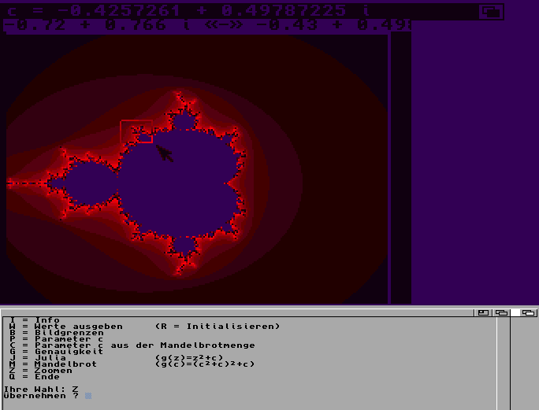

# Mandel-Julia-Plotter
An antique Mandelbrot-/Julia plotter written in Modula 2 for Amiga

# Background

This is a program I wrote for a project at school about Mandelbrot and Julia.

My classmates wrote boring monochrome plotters with Turbo Pascal on boring PC's. Two classmates wrote a version for two [Atari ST](https://en.wikipedia.org/wiki/Atari_ST) computers which were connected via MIDI to calculate by multiprocessing. That was pretty cool.

My approach was to write a Modula 2 version on my beloved Amiga computer with colors and a mouse user interface. It's primitive, but there was a time limit to write this program. I was very proud of the result back at that time.

# Requirements

* Modula 2 Compiler [M2Amiga](http://m2amiga.claudio.ch/)
* The program was written on an [Amiga 500](https://en.wikipedia.org/wiki/Amiga_500) in 1991
* Alternatively use [WinUAE](http://www.winuae.net/), [FS UAE](https://fs-uae.net/) or any other Amiga emulator with [Kickstart 1.3](https://en.wikipedia.org/wiki/Kickstart_(Amiga)). Get an official ROM with [Amiga Forever](http://www.amigaforever.com/).

# Note
The source code is encoded with [ISO 8859-1](https://en.wikipedia.org/wiki/ISO/IEC_8859-1)
